# **Final Projects**

## **THIS IS WHAT WILL LAND YOU A JOB.  COMPLETE A PROJECT TO SHOWCASE ON YOUR RESUME!**

## Respond with your Final Project Concept and who you may be working with for approval!

### **HTML Templates: [https://html5up.net/](https://html5up.net/)**
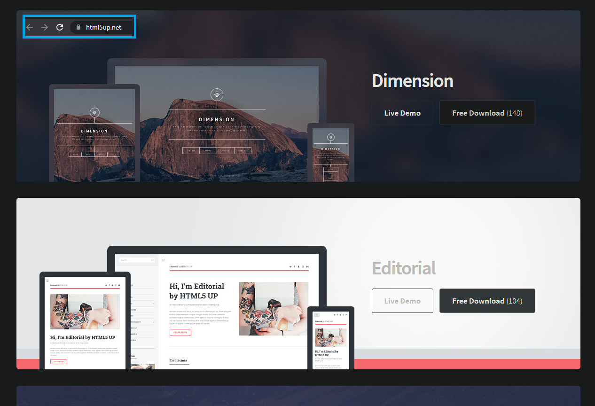

# **Former Student Projects:**

 
 
 

# **Neha Stephen's Final Project:**

**ASP.NET Core MVC website with login functionality, that uses the recipe api to search and display food recipes**

 
 

# **Anthony Allgood’s Personal Website: [https://anthonyallgood.com/](https://anthonyallgood.com/)**

**Personal Portfolio Website**

 
 

# **Ruben Hernandez's Final Project:**

**GODOT Meme Shooter**

 
 

# **Amber Riley’s Final Project: [https://github.com/amberlr/MovieSearchFinalProject](https://github.com/amberlr/MovieSearchFinalProject)**

**ASP.NET Core MVC website that uses the IMDB api to search and display movies**

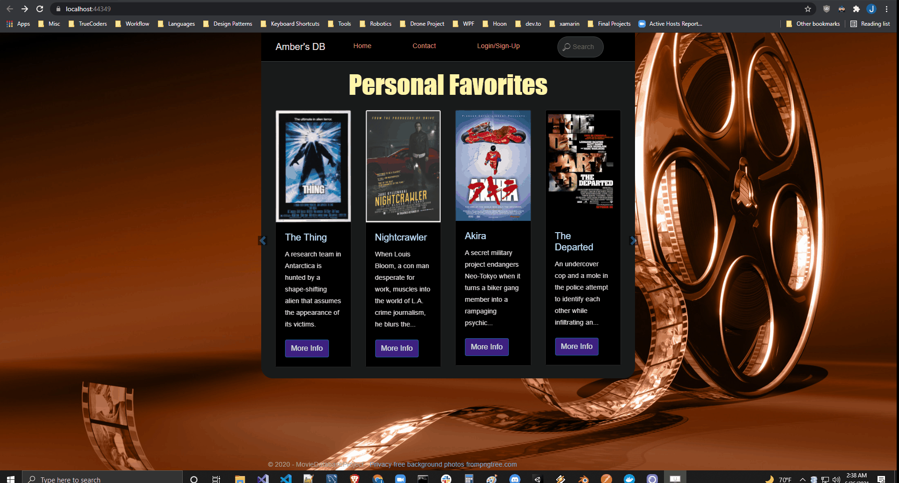

 
 

# **Blake Moore's Final Project:**

**ASP.NET Core MVC website that uses the OpenWeatherMap api to search and display weather information**

 
 

# **Colin Shanahan: [https://shanahancolin.github.io/Personal-Site/](https://shanahancolin.github.io/Personal-Site/)**

**Portfolio Website**

 
 

# **Larissa B: [https://larissabott.github.io/LarissasSite/](https://larissabott.github.io/LarissasSite/)**

**Portfolio Website**

 
 

# **Olakunle Neye: [https://www.olakunle-neye.com/](https://www.olakunle-neye.com/)**

**ASP.NET Core MVC Professional Portfolio Website**

 
 

# **Roger Medrano's Final Project:**

**Portfolio Website**

 
 

### **_HAVING TROUBLE?_**

### **_If you are having trouble coming up with a project idea, check this out!_**  

# Many students have had success creating projects using a cool API:

## **Rapid API: [https://rapidapi.com/](https://rapidapi.com/)**

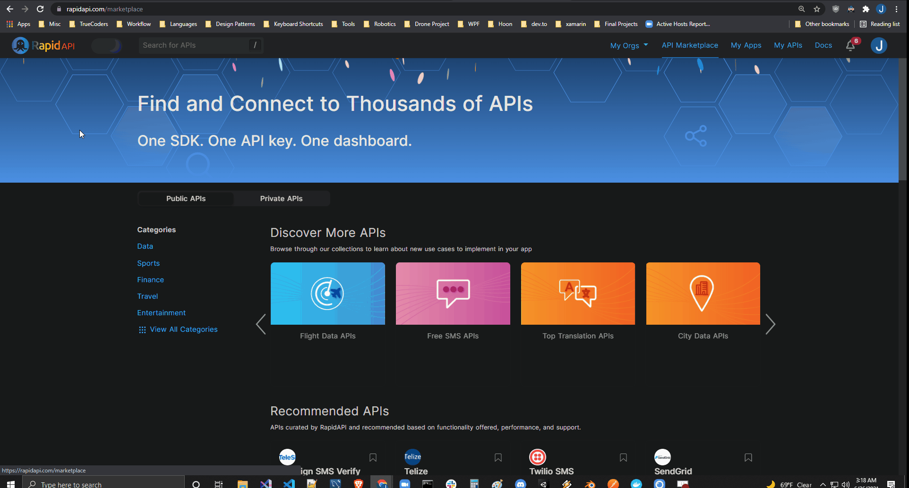

### **_Top Popular APIs: [https://rapidapi.com/collection/popular-apis](https://rapidapi.com/collection/popular-apis)_**

### **_Top Weather APIs: [https://rapidapi.com/collection/top-weather-apis](https://rapidapi.com/collection/top-weather-apis)_**

____

# **_Make a personal portfolio website (single page web application)!_**

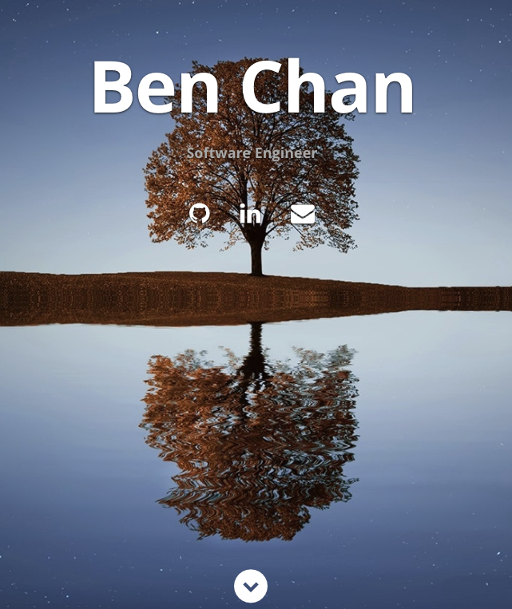

## **[Udemy video for this website](https://www.udemy.com/course/design-and-develop-a-killer-website-with-html5-and-css3/)** &#8593;

**Source Code: [https://bchan.github.io/](https://bchan.github.io/)**

___

# **How to host on github pages: [https://guides.github.com/features/pages/](https://guides.github.com/features/pages/)**

[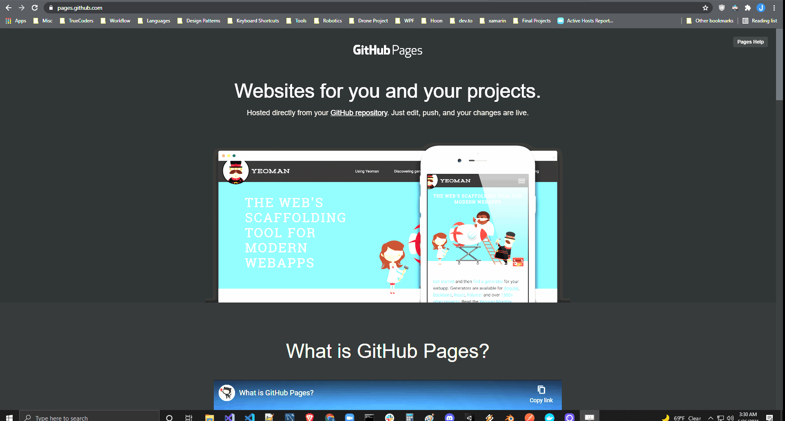](https://pages.github.com/)

___

# **Check these javascript tutorials out:**

## - **[https://javascript30.com/](https://javascript30.com/)**

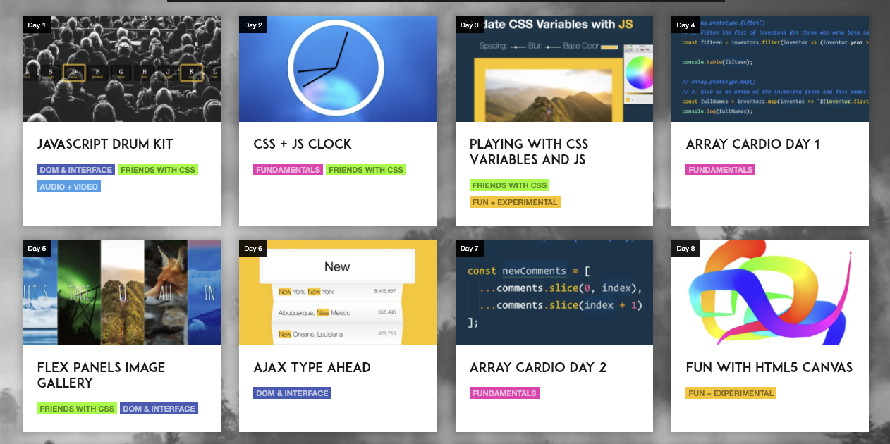

## - **Github repository for these tutorials: [https://github.com/wesbos/JavaScript30](https://github.com/wesbos/JavaScript30)**

___

## - **Build a vertical timeline with HTML CSS and JavaScript: [https://codepen.io/tutsplus/pen/QNeJgR](https://codepen.io/tutsplus/pen/QNeJgR)**

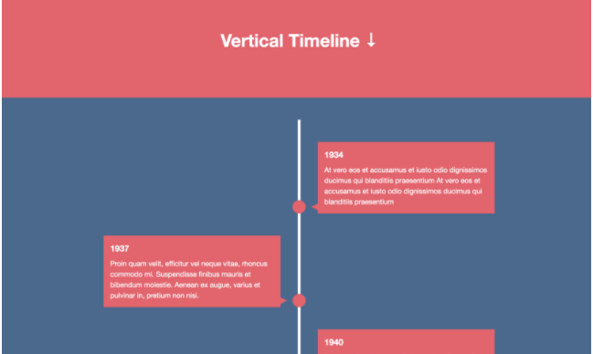

___

## **Things your app could do:**

### - Preferably Implement all CRUD functions on a database
### - Interact with/consume other public APIs
### - Deal with assets, such as images
### - Handle login/registration of user accounts (o auth)
### - Deploy a public Web API via. ASP.NET Core
### - Deploy a front end web app that interacts with your public Web API

___

# **OPTIONAL: Publish your MySql database to Microsoft Azure: [https://docs.microsoft.com/en-us/azure/mysql/quickstart-create-mysql-server-database-using-azure-portal](https://docs.microsoft.com/en-us/azure/mysql/quickstart-create-mysql-server-database-using-azure-portal)**

- ## Mac: [https://docs.microsoft.com/en-us/visualstudio/mac/publish-app-svc?view=vsmac-2019](https://docs.microsoft.com/en-us/visualstudio/mac/publish-app-svc?view=vsmac-2019)

- ## Windows: [https://docs.microsoft.com/en-us/aspnet/core/tutorials/publish-to-azure-webapp-using-vs?view=aspnetcore-3.1](https://docs.microsoft.com/en-us/aspnet/core/tutorials/publish-to-azure-webapp-using-vs?view=aspnetcore-3.1)

[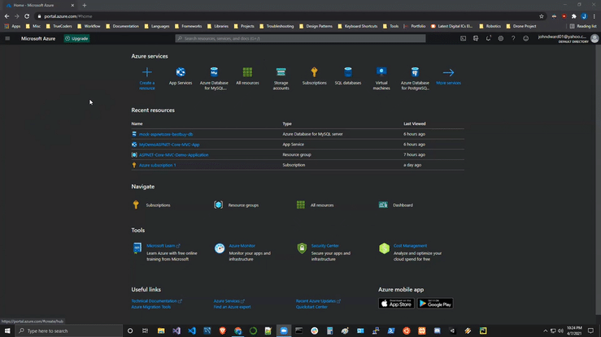](https://docs.google.com/document/d/1FfSOwodbphAWDU1ayJYHAH27XIWkxyWakE0KYk_GndY/edit?usp=sharing)

 Click the gifs to open documentation

# **Resources:**

# [Responsive Bootstrap Website Start To Finish with Bootstrap 4, HTML5 & CSS3:](https://www.youtube.com/watch?v=9cKsq14Kfsw)

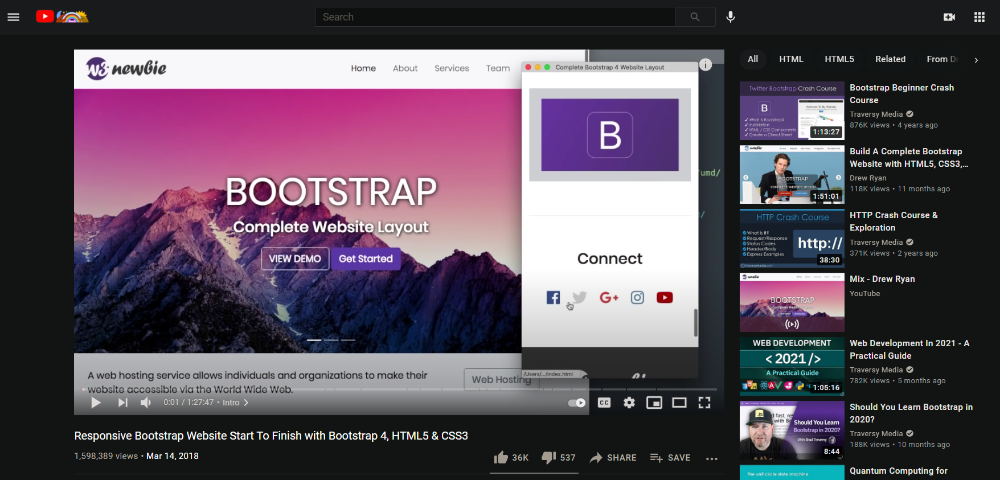

# [Bootstrap 5 Crash Course | Website Build & Deploy:](https://www.youtube.com/watch?v=4sosXZsdy-s)

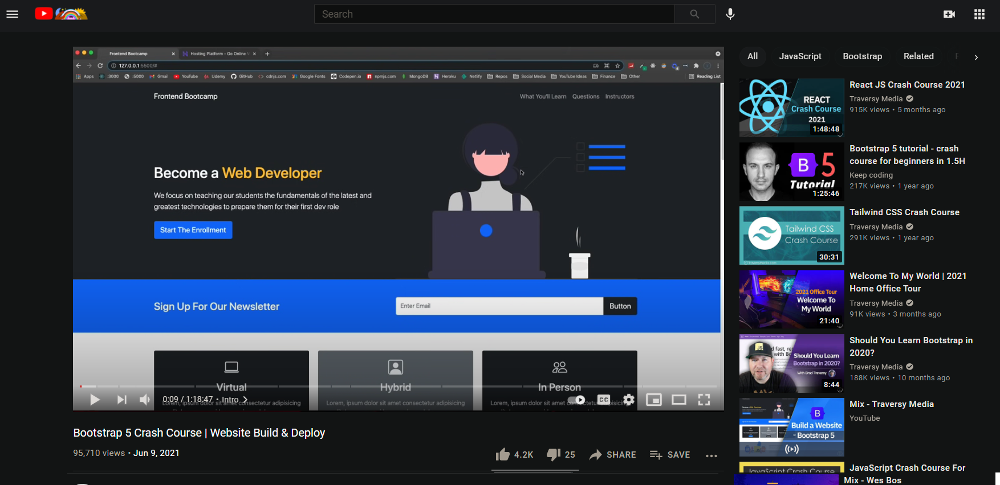

# Javascript30: [https://www.youtube.com/watch?v=VuN8qwZoego&list=PLu8EoSxDXHP6CGK4YVJhL_VWetA865GOH](https://www.youtube.com/watch?v=VuN8qwZoego&list=PLu8EoSxDXHP6CGK4YVJhL_VWetA865GOH)

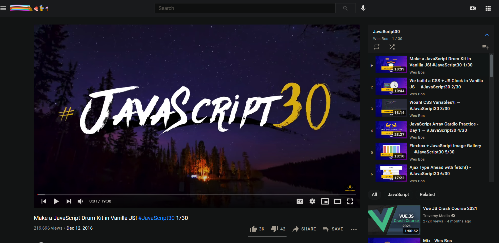

# **Inspiration:**

## **Here is a list of ASP.NET Core apps/documentation that might inspire you as you strive to implement this exercise:**

- C# Corner - [http://www.c-sharpcorner.com/article/angular-demo-application-with-asp-net-core-mvc-rent-a-car/](http://www.c-sharpcorner.com/article/angular-demo-application-with-asp-net-core-mvc-rent-a-car/)

- QuickApp - [https://github.com/emonney/QuickApp](https://github.com/emonney/QuickApp)

- Code Project - [https://www.codeproject.com/Articles/1104729/ASP-NET-Core-Getting-Started-with-ASP-NET-MVC-Core](https://www.codeproject.com/Articles/1104729/ASP-NET-Core-Getting-Started-with-ASP-NET-MVC-Core)

- Microsoft - [https://code.msdn.microsoft.com/The-ASPNET-vNext-Real-Time-b1d27fe4](https://code.msdn.microsoft.com/The-ASPNET-vNext-Real-Time-b1d27fe4)

- Cross Platform - [http://www.cross-platform-blog.com/electron.net/electron.net-musicplayer-app-with-asp.net-core/](http://www.cross-platform-blog.com/electron.net/electron.net-musicplayer-app-with-asp.net-core/)

- Atalasoft - [https://atalasoft.github.io/web-document-viewer/tutorial-demo-application-aspnet-core.html](https://atalasoft.github.io/web-document-viewer/tutorial-demo-application-aspnet-core.html)

- Telerik - [https://demos.telerik.com/aspnet-core/](https://demos.telerik.com/aspnet-core/)

- Practical ASP.NET Core - [https://github.com/dodyg/practical-aspnetcore](https://github.com/dodyg/practical-aspnetcore)

# **Here is a list of demo application videos:**

- Drink&Go Demo - [https://youtu.be/mxgyZmQ-Krc](https://youtu.be/mxgyZmQ-Krc)

- Drink&Go Tutorial - [https://www.youtube.com/playlist?list=PL2Q8rFbm-4ruplp2SRUTQjZaFfxh-knS0](https://www.youtube.com/playlist?list=PL2Q8rFbm-4ruplp2SRUTQjZaFfxh-knS0)